>  <table>
>  <tr>
>  <td align="center"></td>
>  </tr>
>  </table>

# Pipeline

>  <table>
>  <tr>
>  <td align="center">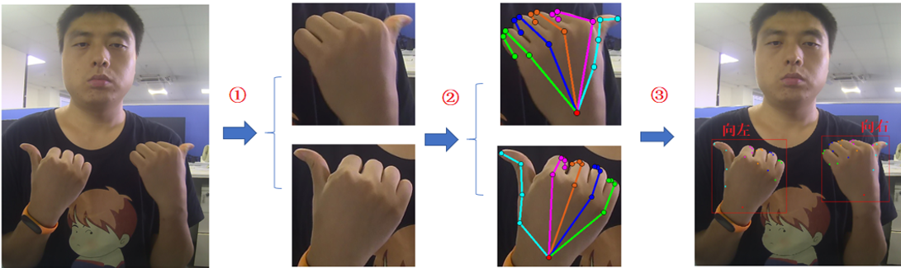</td>
>  </tr>
>  </table>

将这三部分的模型结合起来，做一个完整系统，观察一下总体的效果。

•①目标检测：YOLOv3

•②关键点检测：ResNet-50/HRNet-Onehand10k

•③手势识别 ：几层FC+BN+LeakyReLu

> 参考SimpleHRNet项目来实现看YOLOv3和PoseResNet/HRNet 的结合。

# 1、重新训练YOLOv3

> 配置和训练过程可以参考YOLOv3-SPP的教学视频，二者基本一致。
>
> 可以通过GitHub中SimpleHRNet项目所给出的YOLOv3项目链接中的教程进行数据准备和训练。
>
> 由于默认是单GPU，batch=16进行训练，所以训练100个epoch用了两天多的时间，而之前使用多GPU训练的YOLOv3-SPP只需要两小时左右。
>
> **训练性能：**
>
> >  <table>
> >  <tr>
> >  <td align="center">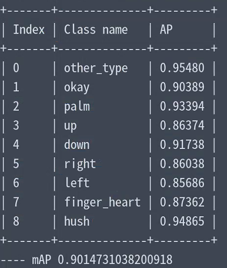</td>
> >  </tr>
> >  </table>
>
> ----------
>
> YOLOv3进行9分类的话有时会出现同一只手出现多个非常相近的框，这些框的预测类别是不同的，因此非最大抑制对他们无效。
>
> 为了解决这个问题，以及提高召回率，有两个解决方法：
>
> + 1、对预测框再进行一次类间抑制
> + 2、重新训练一个只检测一类目标的YOLOv3，即把9种手势都全当hand类，尽量提高召回率，然后用分类网络进行分类。
>
> --------
>
> 只检测hand类：
>
> >  <table>
> >  <tr>
> >  <td align="center">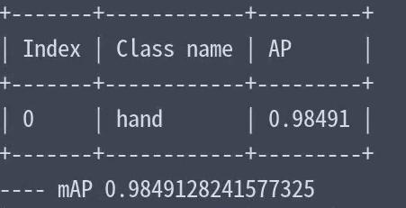</td>
> >  </tr>
> >  </table>
>
> >  <table>
> >  <tr>
> >  <td align="center">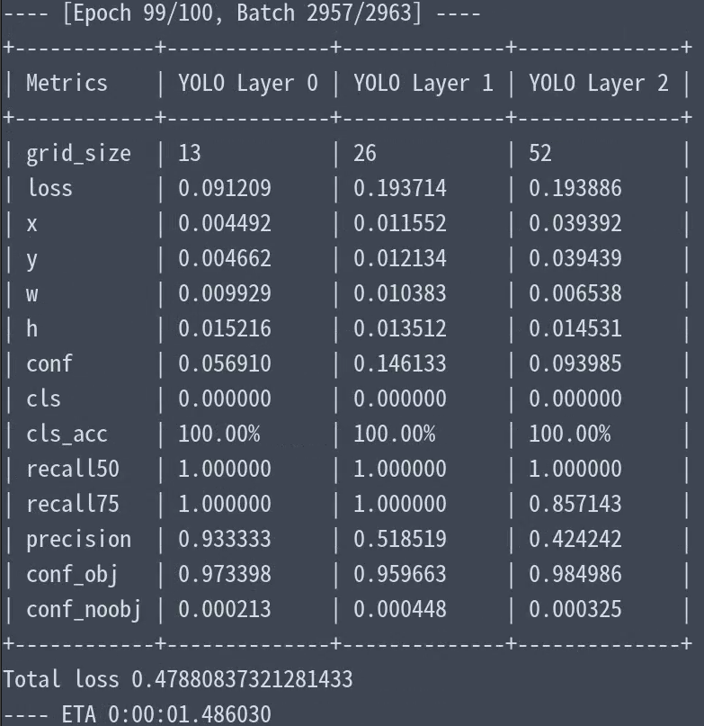</td>
> >  </tr>
> >  </table>

# 2、重新训练PoseResNet

# 2.1、模型输入和输出

> 姿态估计网络训练的时候，数据加载需要给定三个参数：
>
> + image: 预处理和数据增广后的图像，即模型输入。
> + target: 目标热图，一般是高斯热图，相当于真值标签。
> + target_weight：关键点权重，每个关键点的损失函数值的权重，对于不可见点默认为0，即不考虑不可见点的损失。
>   + 但是珠海数据集上没有标注点是否可见，默认都是1，但有时候输出的三元组（x,y,c）,c是关键点置信度。
>   + 我认为大拇指、食指以及小指的指尖两三个点的精度对分类性能的影响较大。

## 2.2、损失函数

> 姿态估计的顺势函数，用的其实就是MSE，均方差。即也是用预测点坐标与真值坐标的欧氏距离来衡量。
>
> 项目里给了两种损失函数，默认使用第一种：
>
> ---------
>
> + **JointsMSELoss**( **output**, **target**, **target_weight**)
>   + 初始化：
>     + **use_target_weight**=True; 使用关键点权重
>   + 输入:
>     + **output**:  输出的预测热图（batch, nof_joints, h, w）
>     + **target**: 目标高斯热图（batch, nof_joints, h, w）
>     + **target_weight**：各个关键点的损失占比权重，重要的关键点权重大。每个关键点的两个热图先乘以权重，计算MSELoss。
>   + 计算过程，分别计算每个关键点的的加权MSE损失，最后再取均值。
>
> -------
>
> + **JointsOHKMMSLoss**( **output**, **target**, **target_weight**)
>   + 初始化：
>     + **use_target_weight**=True; 使用关键点权重
>     + **topk**=8； 计算损失最大的前几个关键点的损失均值
>   + 输入一样
>   + 计算过程：先求出每张图片上损失函数值最大的前 **topk** 个关键点的损失均值 m，然后再求batch张图片的损失m的均值。

## 2.3、评价指标

> 很明显，我们需要一些指标来量化模型性能，对于不同的任务来说，通常有着不同的评价指标。
>
> 在姿态估计中，实质上就是评价关键点坐标是否准确，所以评价指标中必然包含预测坐标与真值坐标的偏差，这个偏差一般是欧氏距离。
>
> 但是对于不同尺度的检测对象，用欧式距离计算出相同偏差值，对应的“真实误差”确实不同的，对于大目标而言，坐标差几个像素没啥问题，但对于小目标而言相差几个像素，可能预测坐标就相等不准确了。因此，评价指标中衡量偏差必须考虑到目标尺度变化所带来的影响。
>
> ---------
>
> [🔗：博客](https://blog.csdn.net/zxf_1991/article/details/104279387)
>
> 
>
> + **PCK-（Percentage of Correct Keypoints）**
>   + 偏差小于阈值的关键点比例， 即PCK ≤ 1, 值越大越好，当所有点都正确（小于阈值）时取1。
>   + 偏差 = 关键点与真值点的欧式距离 / 这个目标的尺度因子
>   + 目标尺度因子，用来消除目标尺度变化的影响，不同数据集的标注不同：
>     + **FLIC**数据集是以当前人的躯干直径作为尺度因子，即左臂点到右臂点的欧式距离
>     + **MPII**数据集是以当前人的头部直径作为尺度因子，即头部**Rect**的左上点**LT**与右下点**RB**的欧式距离，使用此尺度因子的姿态估计指标也称**PCKh**
> + **OKS-（object keypoint similarity）**
>   + 目标关键点相似度， COCO数据集中引入，计算时仅考虑可见点。
>
> -------
>
> 总结：
>
> ​	这些评价指标都归一化了，以（有效）点数之和为底，取值范围都是0~1，并且取值越高越好。

# 3、标注文件整合

## 问题1：发现关键点映射回原图后有点偏移，而且偏移还有点多。

> >  <table>
> >  <tr>
> >  <td align="center">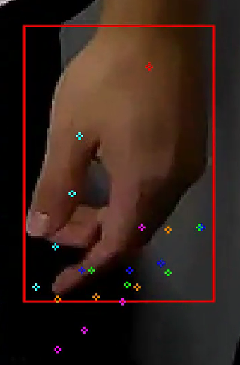</td>
> >  </tr>
> >  </table>
>
> + 问题分析，经过图片上手动计算的映射发现手算时算法是没有问题的，但是程序运行有问题，对于原图bbox的宽高小于256的都是直接从原图截取一个256的方形区域，
>   + 因此，坐标从截取图映射回原图，只需要将坐标原点设置为方形区域在原图上的左上角坐标即可。
>   + 观察发现，映射后的bbox是没问题，但是计算在原图的左上角坐标时，如果坐标值x>witdth_image - 256 或 y > height - 256 时需要校正   。
>   + 我发现在获取截取图时，当bbox存在一边大于256时，取方形区域没有进行越界检查，这就是有些截取图的手不见了一半的缘故，**以后的新样本需要增加检查**。
>
> ----------
>
> 问题：现在点映射的精度不高，会发生点的偏移。
>
> 问题已解决，当计算的截取区域越过图像边界时，需要调整边界框后，再映射关键点映射。

# 4、模型整合

## 问题1： 关键点的映射存在问题。

>  <table>
>  <tr>
>  <td align="center">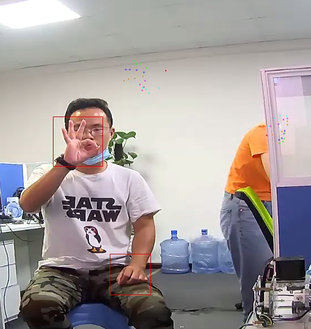</td>
>  </tr>
>  </table>

-----

可以观察到边界框的预测是可以的，但是关键点存在较大问题：

1. 关键点并不在框内
2. 关键点存在旋转，这可能是输入PoseResNet时经过了旋转变换。

解决思路：

1. 现在bbox预测时比较准确的，我们可以根据bbox像之前那样裁剪和放缩成256x256的截取图作为姿态估计的输入
2. 姿态估计的输入不做旋转变换，预测的关键点重新映射回原图。
3. 整个裁剪和预测的过程，其实跟之前一模一样。

-------

最终解决方法，坐标预测是没问题的，原来是我把输出的x,y顺序搞错了，simpleHRNet默认输出是（y,x,c），我一直用的是（x,y,c）,

因此把输出成（x,y,c）即可。

从修改前的备注可以看出，输出的三元组顺序是【y,x,c】
-----------------

纠正后的检查效果，如下图：

<table>
<tr>
<td align="center">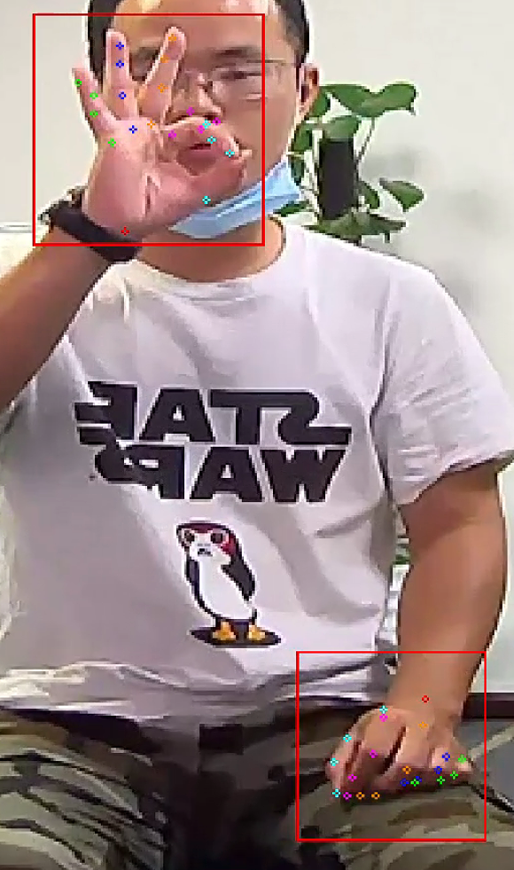</td>
</tr>
</table>

<table>
<tr>
<td align="center">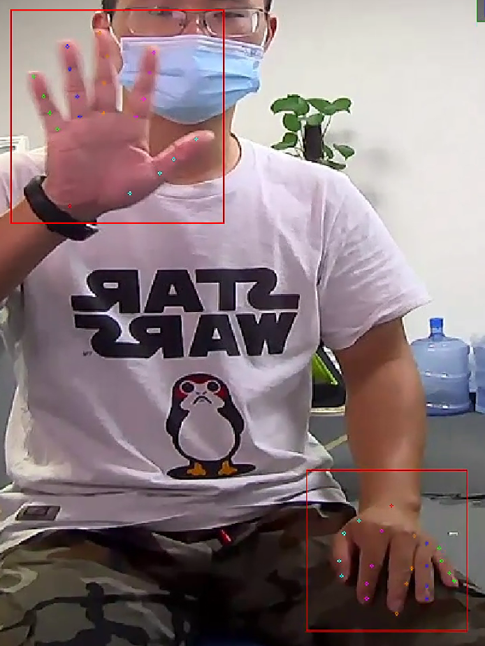</td>
</tr>
</table>

可以看出，预测的效果还是可以滴，很好，可以进行下一步的操作了，即增加关键点分类。

这里除了增加我训练好的分类网络外，也可以将yolov3的分类结果一起输出，作为一个对比。同时，增加了类别后，画框的颜色也可以根据不同的种类来改变。 

------------

# 5、分类模型

现在不用YOLOv3进行分类，用直接用FC+BN+LeakyReLu来分类，性能很差，可能是框和点的误差累计在一起所导致。

<table>
<tr>
<td align="center">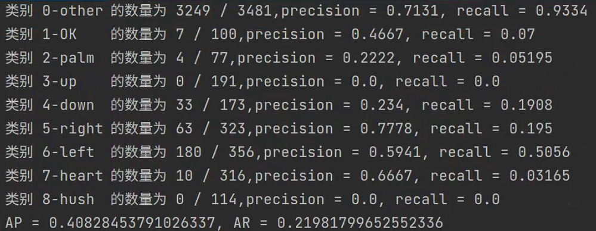</td>
</tr>
</table>

<table>
<tr>
<td align="center">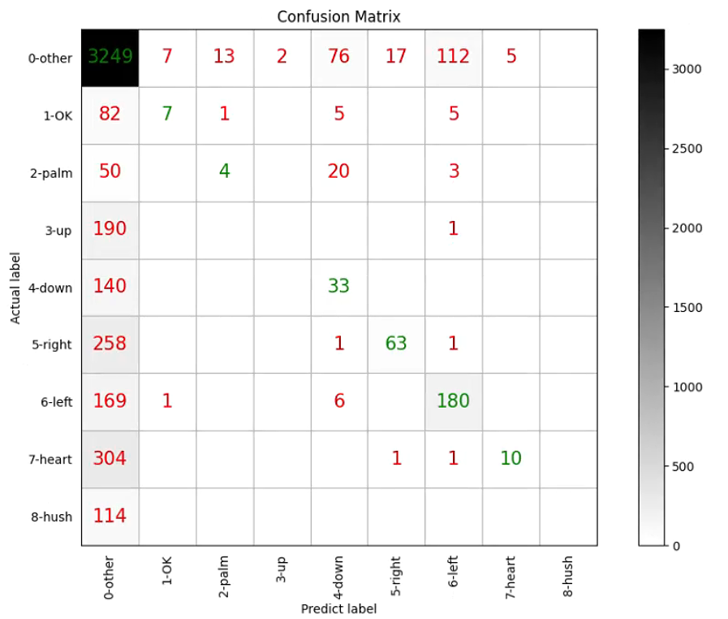</td>
</tr>
</table>

<table>
<tr>
<td align="center">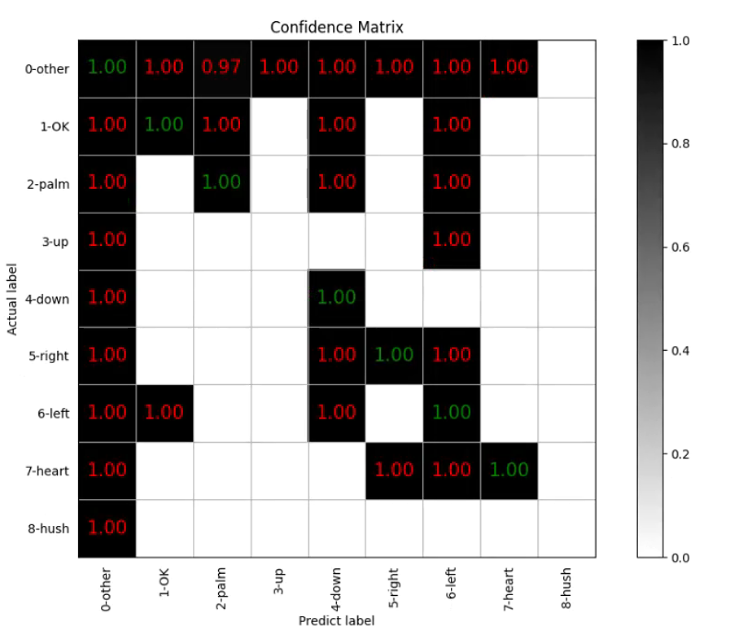</td>
</tr>
</table>

而且错误的类别的平均置信度都是1，这就很恐怖了，这可能是因为预测错误的点很无序，因此很像“0-其他”类。

------

我测了一下关键点真值的ap，发现也只有0.49，那么问题原因找到了，分类前没有将关键点映射回框内，以及归一化到0~1。

## 真值测试

**进行了映射和归一化后，真值测试结果如下:**

<table>
<tr>
<td align="center">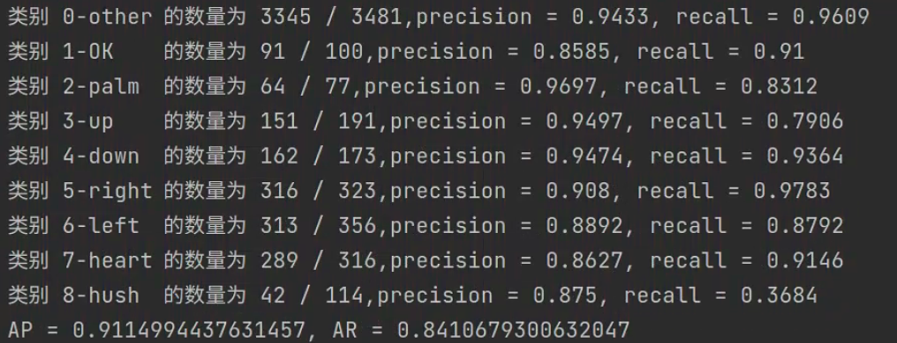</td>
</tr>
</table>

<table>
<tr>
<td align="center">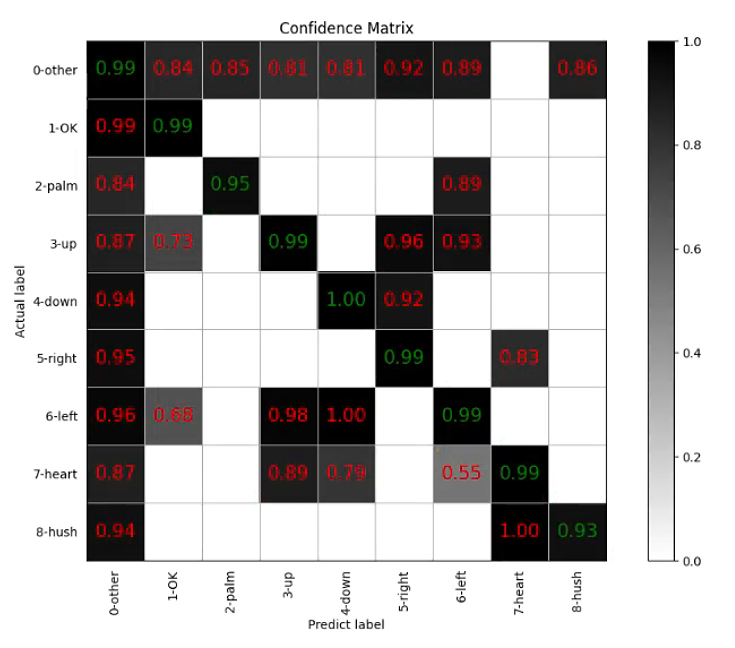</td>
</tr>
</table>

<table>
<tr>
<td align="center">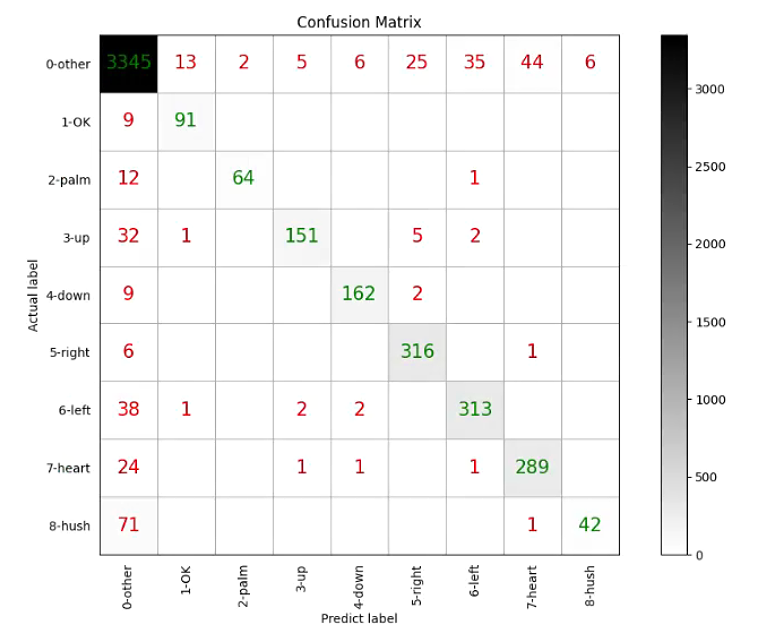</td>
</tr>
</table>

全连接网络太容易过拟合了，之前训练时，模型的AP还有0.98+，而且现在发现对于“hush”的手势，错分太大，可能是缺乏图像背景的语义信息。

----------

## 测试 0.01

阈值conf_thr = 0.01时，对预测关键点的测试如下：

<table>
<tr>
<td align="center">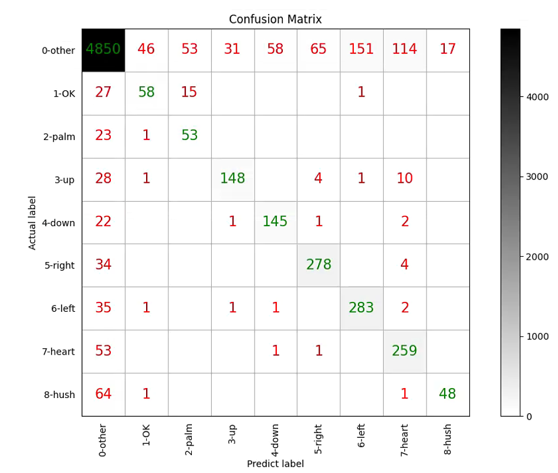</td>
</tr>
</table>

<table>
<tr>
<td align="center">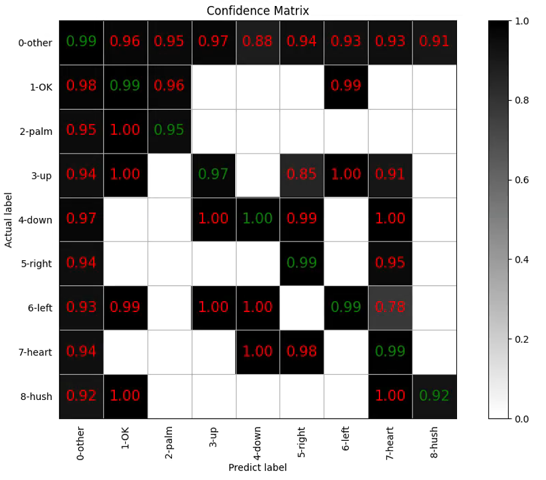</td>
</tr>
</table>

<table>
<tr>
<td align="center">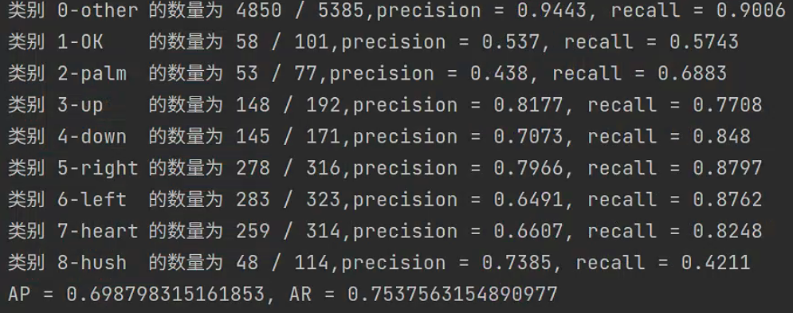</td>
</tr>
</table>

很明显进行映射和归一化后，AP值提升到了近0.7， 观察上图的平均置信度值，对角线置信度最低的时0.92，可以将置信度阈值设置为0.915

----

## 测试 0.915

<table>
<tr>
<td align="center">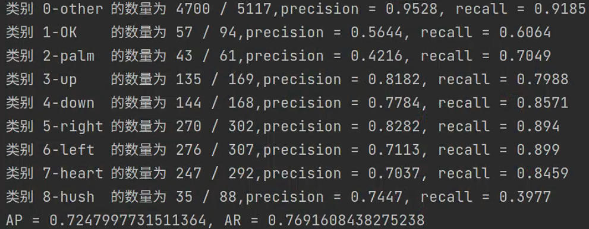</td>
</tr>
</table>

性能提升不大，AP还是0.72左右。

# 6、在线测试

测试效果

<table>
<tr>
<td align="center">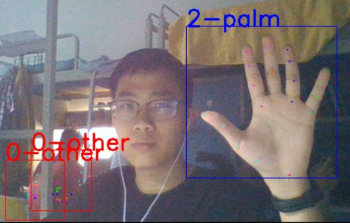</td>
</tr>
</table>

调用笔记本的前置摄像头进行了测试，发现了以下一些问题:

+ 错误检测框很多，即使图中没有手，也会检测出几个目标，目前简单地用框的置信度要去掉部分框。
+ 当预测目标较多时，算法的处理速度有点慢
+ 算法对光照比较敏感，在光照强度适中时，检测效果还行。
+ 摄像头成像的镜像问题，在现实中向右，会被检查成向左

------

# 7、改进思路：

1. 我将关键点检测网络从PoseResNet50转换成了HRNet48, AP从0.72提升到了0.75左右，说明关键点的精度是非常重要的。

2. 分类网络目前用的是真值进行训练的，可以尝试使用预测点进行训练。

3. 在摄像头测试中，误检框很多，可以通过设置框的置信度阈值来去掉一些框。

4. 关键点分类对于手心和手背两种情况都会视为‘手掌’，对于‘嘘’的话，需要结合背景的语义信息来分类，这些情况都说明了单纯依靠关键点是很难正确分类的，需要结合图像的其他语言特征。

5. 现在的想法是，最终的分类网络不再直接用点坐标进行输入，输入改成关键点热图和前面的特征图进行拼接融合后所得的特征图。

   <table>
   <tr>
   <td align="center">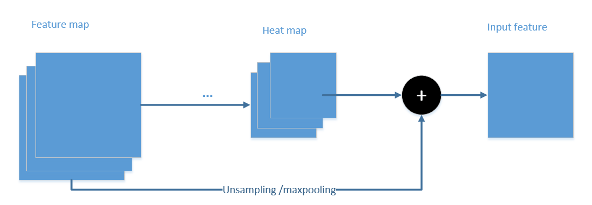</td>
   </tr>
   </table>
   
   具体怎么融合需要做多个实验, 需要考虑以下因素：
   
   + 特征图和热图大小不一致。
   + 大小对齐后，怎么拼接，是直接相加成一个特征图还是在通道方向上拼接起来。
   + 可以看一下其他论文的思路。

